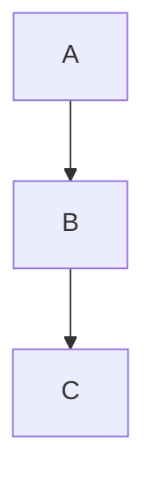

# H1 제목

## H2 제목

### H3 제목

#### H4 제목

##### H5 제목

###### H6 제목

## 강조

**굵게 별표 2개** 와 __굵게 언더스코어 2개__.

*기울임 별표* 와 _기울임 언더스코어_.

***굵은 기울임*** 또한.

~~취소선~~ 처리.

`인라인 코드`.

하이라이트 ==형광펜== 처리 (bold 로 폴백).

## 링크

- 일반: [Anthropic](https://www.anthropic.com)
- 자동 `<URL>`: <https://github.com/ssabro/hwpx-skill>
- 평문 URL linkify: https://example.com 이 링크가 됨
- 참조 링크: [참조 예시][ref1]
- 앵커: [H1 으로](#h1-제목)

[ref1]: https://www.anthropic.com

## 이미지

- 존재: 
- 미존재: 

## 목록

### 순서 없는 (dash / star / plus)

- dash 항목
- 두 번째
  - 중첩 1
    - 중첩 2
* star 항목 (다른 마커)
+ plus 항목 (또 다른 마커)

### 순서 있는

1. 첫째
2. 둘째
   1. 중첩 첫째
   2. 중첩 둘째
3. 셋째

### 다른 start 번호

5. 다섯째
6. 여섯째

### 태스크 체크박스

- [ ] 할 일
- [x] 완료
- [ ] **굵게** 포함

## 코드

### Fenced

```python
def hello(name):
    print(f"안녕, {name}!")
```

### 언어 라벨 없음

```
plain text code
```

### 들여쓰기 4칸

    indented code line 1
    indented code line 2

### Mermaid 다이어그램 (미지원 — 라벨로 표시)



## 인용문

> 일반 인용문.
> 두 줄에 걸침.

> 중첩 인용:
>
> > 안쪽 인용

### GFM Alerts

> [!NOTE]
> 참고 블록 내용.

> [!TIP]
> 팁 블록.

> [!IMPORTANT]
> 중요 블록.

> [!WARNING]
> 경고 블록.

> [!CAUTION]
> 주의 블록.

## 수평선

앞 단락.

---

하이픈 3개.

***

별표 3개.

___

언더스코어 3개.

## 표 (GFM + alignment)

| 왼쪽 정렬 | 가운데 정렬 | 오른쪽 정렬 |
|:----------|:-----------:|------------:|
| A | B | C |
| 안녕 | 世界 | 123 |

## 각주

본문에 각주 참조[^note1] 가 있다. 두 번째 각주[^note2] 도.

[^note1]: 첫 번째 각주 내용.
[^note2]: 두 번째 각주 내용.

## 정의 목록

용어 A
: A 의 정의.

용어 B
: B 의 첫 번째 정의.
: B 의 두 번째 정의.

## 줄바꿈

첫째 줄 (공백 2개)  
둘째 줄.

## 이스케이프

\*별표 2개가 아님\* 과 \**별표 리터럴\**.

## 인라인 HTML (미지원 — 원문 통과)

<span style="color:red">빨강</span> · <u>밑줄 태그</u> · <br> 태그.

## 수식

인라인 $E=mc^2$ 수식과

$$
a^2 + b^2 = c^2
$$

블록 수식.

## 이모지

:smile: :heart: :thumbsup: :warning: :bulb: :fire: :tada:

## 첨자 (미지원)

H~2~O 와 x^2^ — 원문 그대로 표시됨.

---

끝.
